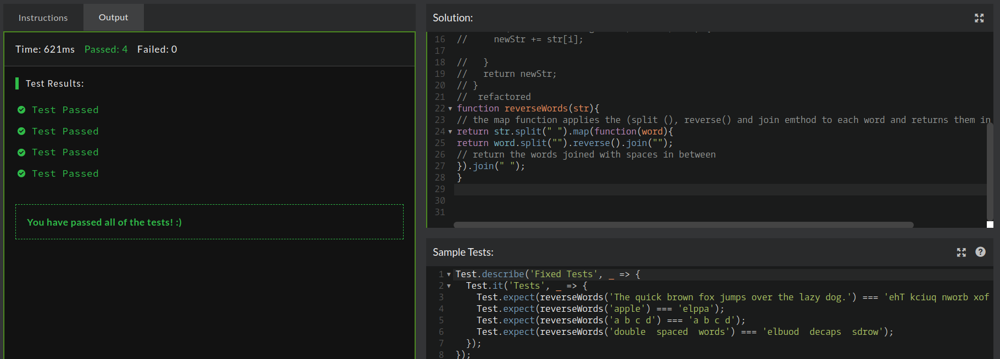

## CodeWars Challenge- 20

*Description:*
Write a reverseWords function that accepts a string a parameter, and reverses each word in the string. Any spaces in the string should be retained.

*Test Cases:*

Test.describe('Fixed Tests', _ => {
  Test.it('Tests', _ => {
    1. Test.expect(reverseWords('The quick brown fox jumps over the lazy dog.') === 'ehT kciuq nworb xof spmuj revo eht yzal .god');
    2. Test.expect(reverseWords('apple') === 'elppa');
    3. Test.expect(reverseWords('a b c d') === 'a b c d');
    4. Test.expect(reverseWords('double  spaced  words') === 'elbuod  decaps  sdrow');
  });
});

## Languages Used

1. JavaScript

## Takeaway:

My original solution was to create a function that would split each string into substrings and then call a reverse function on that substring. The newly reversed string is then stored at the current position. After solving the problem I wanted to refactor my code, I searched through methods that would allow me to apply a function to each element in the array and was able to use the map method.

By splitting the string I then use the map method and call my reverse function directly on each string in the array. This function returns all the strings reversed in the same order passed in and so I can then join each string with a space.

## Learned:

I learned how to use the map method to apply a function on each element in an array. This cut down on several lines of code and I find makes the code cleaner, and easier to follow.  
